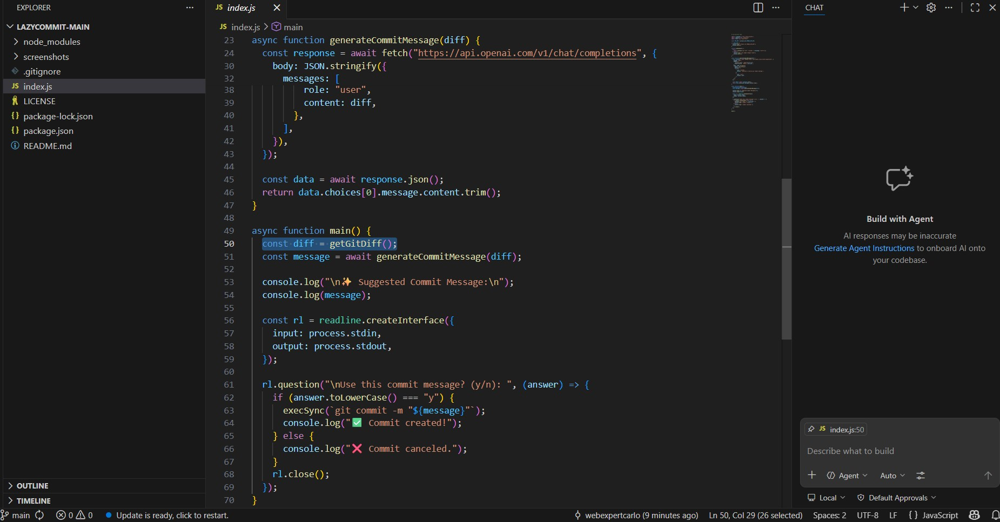
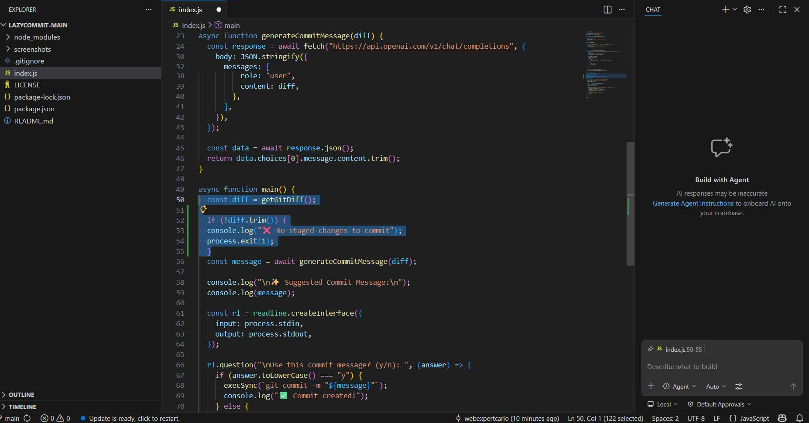
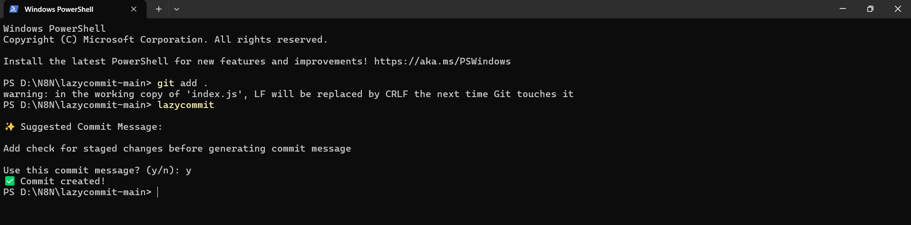
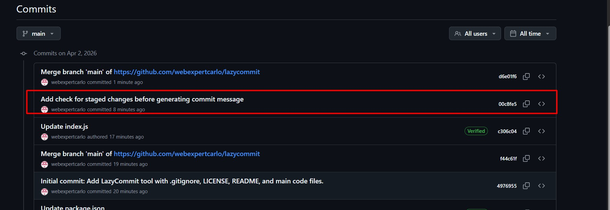

# LazyCommit 🚀

LazyCommit is a simple CLI tool that automatically generates meaningful Git commit messages using AI.

No more writing:
"fix stuff" 😅

---

## ✨ What it does

* Reads your code changes
* Uses AI to understand them
* Writes a clean commit message for you

---

## ⚡ Installation

```bash
npm install
npm link
```

---

## 🔑 Setup

Set your OpenAI API key:

**Windows:**

```bash
setx OPENAI_API_KEY "your_api_key"
```

**Mac/Linux:**

```bash
export OPENAI_API_KEY="your_api_key"
```

---

## ⚡ How to use

1. Stage your changes:

```
git add .
```

2. Run:

```
lazycommit
```

---

## 🎯 Example

Before:

```
git commit -m "update"
```

After:

```
feat: add login validation and error handling
```

---

## 📸 Demo

### 1. Before (no smart commit message)



### 2. Code Change in VS Code



### 3. AI Generates Commit & Creates It



### 4. Commit Visible on GitHub



---

## 🛠 Why this tool?

Writing commit messages is boring and often ignored.
LazyCommit makes it automatic and clean.

---

## 🤝 Contributing

Feel free to improve this project!

---

## ⭐ Support

If you like this project, please star the repo!


